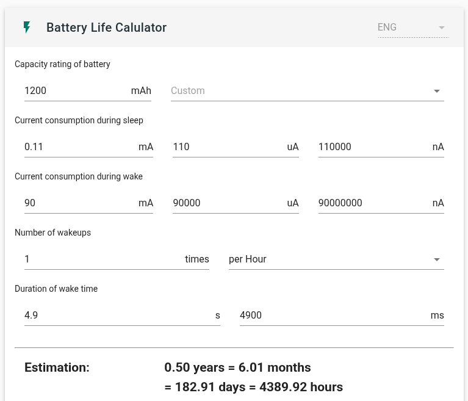
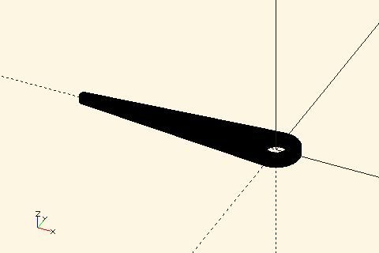

<div align="center">
  
</div>

# Tenki Hari (Weather Needles, *ja: 天気針*)

A minimal weather forecast display gadget – and an experiment in building a battery-powered IoT device with [ESPHome](https://esphome.io/).

## Intro: How I Learned to Stop Worrying and Love ESPHome


Building home IoT gadgets with embedded programming is fun. However, keeping track of devices scattered around the house ("What *was* that hostname?"), managing over-the-air software updates, and integrating with Home Assistant... not so much.

That's where ESPHome comes in. Think of it as Ansible or Kubernetes for ESP microcontrollers (beware, there's a lot of explicit YAML contents ahead).  It's somewhat similar to [Tasmota](https://tasmota.github.io/docs/), but in my experience, Tasmota is more focused on being an alternative firmware for ESP-based IoT devices.  
ESPHome, while it can certainly be used that way, really shines when it comes to customization.

Here's what I like about ESPHome:

- **Multiple flashing methods supported:** USB, Web Serial!, OTA, via Web UI, and even a full-featured **CLI**.
  - You can even see `ESP_LOGD()` logs over the air.
- **YAML-based device definitions:** (Yes, it's a paved road to YAML HELL.  Keep it simple, stupid!)
  - Secret management using `include` YAMLs (about as good as a `.gitignore`-ed `config.h`).
  - Config validation and autocompletion, thanks to the defined schema.
- **Simple device management dashboard::** Again, CLI is supported, meaning it works headless.
- **Automatic Home Assistant integration:** Devices are auto-detected with HA entities.
- **Extensive peripheral/external device support:** e.g., SPI/I2C sensors, etc.

For example, add this to your device's YAML and flash:

```sh
switch:
  - platform: gpio
    name: "Charge Port 1"
    pin: GPIO4
    restore_mode: RESTORE_DEFAULT_ON
```

Voila! Before you can even finish sipping your coffee, a switch entity appears in your Home Assistant instance.


Sure, it takes away some of the coding fun. However, you can still inject C++ snippets using the [`lambda:` syntax](https://esphome.io/cookbook/lambda_magic.html).  Black magic?  Maybe.  ESPHome is also can be considered as a wrapper that generates Arduino or esp-idf based firmware from your YAML definitions.

## Installation (Quick Overview)

The official ESPHome [Getting Started](https://esphome.io/guides/getting_started_command_line) guide covers installation, but in my case, it was as simple as adding 10 lines to my Home Assistant `docker-compose.yaml`:

```yaml
  esphome:
    container_name: esphome
    image: ghcr.io/esphome/esphome:2024.12.4
    volumes:
      - ./esphome/config:/config
      - /etc/localtime:/etc/localtime:ro
    restart: always
    privileged: true
    network_mode: host # For mDNS
    env_file:
      - esphome.env # This contains `USERNAME` and `PASSWORD`
```

Then, just navigated to http://localhost:6052, clicked `NEW DEVICE`, and followed the wizard. ESPHome creates a `<device-name>.yaml` file to your local filesystem, which you can edit via the dashboard and update via `Install > Wirelessly`.


With this setup, you also need to register the device with Home Assistant for the first time.  When the device is discovered in "Integrations," copy and paste the API key from ESPHome.


One quick note: for initial flashing via the dashboard (using Web Serial), you'll need `localhost` or `https://`. SSH port forwarding (`-L 6052:localhost:6052`) to your home lab server, or you can set up HTTPS with Caddy or Tailscale.  Alternatively, use the [ESPHome Flasher](https://web.esphome.io/) or the CLI (`docker compose exec esphome`).

### Building a Battery-Powered Device with ESPHome

I've built several battery-powered devices in the past, primarily using Arduino ([1](https://github.com/likeablob/slow-movie-player-7c), [2](https://hackaday.io/project/184009-endless-endless-eight)).  Could I build something similar with ESPHome? (Spoiler: Yes!)

Here's the goal:

- An ESP32-C3 powered by 4 x NiMH AA batteries, lasting for *at least* 6 months.
- Wakes up hourly, retrieves the weather forecast for a few hours ahead, and moves a servo to indicate the conditions.
- Wakes up at *specific* times (not just periodically), like 5 minutes past the hour, every hour (`5 * * * *`).


First, [deep sleep is supported](https://esphome.io/components/deep_sleep).  However, by default, ESPHome [provides an API on the device itself](https://esphome.io/components/api) (meaning Home Assistant acts as the client). [Here is why.](https://esphome.io/components/api#advantages-over-mqtt)  Normally, this approach offers low latency, but there's a delay between waking from deep sleep and being recognized by Home Assistant (due to a 60-second polling interval for offline devices ).

Fortunately, [MQTT is also an option](https://esphome.io/components/mqtt.html). Just add this to the top of your YAML:

```yaml
mqtt:
  broker: !secret mqtt_broker
  username: !secret mqtt_username
  password: !secret mqtt_password
  discovery: true
  discovery_prefix: homeassistant
```

Home Assistant will automatically discover the device through the MQTT integration (via the `*/config` topic).  
To receive data, you just need to define the topic and action using `on_message`:

```yaml
mqtt:
  ...
  on_message:
    - topic: home/homeassistant/weather/forecast/3h/condition
      qos: 0
      then:
         ...
```

I use a Home Assistant "Automation" to publish weather forecast data to MQTT topics every hour (with the "Retain" flag set). (See: [Automation Template](./ha_automation_publish_forecast_mqtt.yaml))  
The device subscribes on wake-up and gets the retained data immediately.

### Hitting the Hay Again

How do we let the device wake up from deep sleep periodically? And then let it take a nap for almost an hour.

This is where `deep_sleep`, `mqtt`, and `time` components work together.  
First, define the `deep_sleep` component.  

```yaml
deep_sleep:
  id: deep_sleep_1
  run_duration:
    default: 20s
    gpio_wakeup_reason: 5min
  sleep_duration: 30min
  wakeup_pin:
    number: GPIO4
```

`run_duration` is the *maximum* time the device stays awake. We'll force it to sleep sooner, once it's done its work. `gpio_wakeup_reason` lets us use a shorter `run_duration` if we wake up via the `wakeup_pin` (handy for OTA updates – more on that later).   
If all you need is a simple periodic wake-up (every 30 minutes, say), you can just use `sleep_duration` directly.

To wake up at HH:05, we calculate the time difference between now and the next 5-minutes-past-the-hour mark, and sleep for that duration. The `time` component gives us the current time. Of course, DNS resolution time can be reduced to save on our limited wake-time budget, but let's keep it simple with `0.pool.ntp.org`:

```yaml
time:
  - platform: sntp
    id: sntp_time
    timezone: Etc/UTC
    servers:
      - 0.pool.ntp.org
      - 1.pool.ntp.org
      - 2.pool.ntp.org
```

If you just wanted to wake up at a fixed time each day (e.g., 6 AM), you could use [`until:`](https://esphome.io/components/deep_sleep.html).  But, as of now, [`until:` isn't templatable](https://github.com/esphome/feature-requests/issues/2532) (means no `lambda:` allowed), so we'll do the calculation ourselves.

On wake-up, the device connects to Wi-Fi (DHCP request included), syncs time via SNTP, connects to MQTT, and subscribes. Because the Home Assistant automation publishes *retained* messages, the device receives them immediately.   

We have four servos (for 3h/6h/9h/12h forecasts), so we're using four MQTT topics. That means four `on_message` handlers. We need to sleep *after* receiving all of them.

```yaml
  on_message:
    - topic: home/homeassistant/weather/forecast/3h/condition
      qos: 0
      then:
        - lambda: |-
            ESP_LOGD("main", "Received value is %s", x.c_str());
...
    - topic: home/homeassistant/weather/forecast/6h/condition
      qos: 0
      then:
...
    - topic: home/homeassistant/weather/forecast/9h/condition
      qos: 0
      then:
...
    - topic: home/homeassistant/weather/forecast/12h/condition
      qos: 0
      then:
...
```

For this, we'll use the `script` component. It's for reusable logic, and we can write it in the very similar manner to Home Assistant scripts.

This is the heart of the operation.  It might look a bit long, but it's fairly straightforward:

1.  Increment `received_count` (using `lambda:`). We'll add servo control logic here later.
2.  If `received_count` is 4 (all messages received), start the sleep process.
3.  Power up the servos (via a high-side FET switch) and wait for them to move.
4.  Wait for SNTP time synchronization to complete.
5.  Calculate the sleep duration (in milliseconds) and call `deep_sleep.enter`.
6.  Done!

```yaml
script:
  - id: set_servo_angle
    mode: queued
    then:
    # 1. Increment the counter
      - lambda: |-
          // Implement the servo control logic here
          id(received_count)++;
    # 2. Check if all messages are received
      - if:
          condition:
            lambda: |-
              return id(received_count) >= 4;
          then:
            - logger.log: "The data has been collected. It's time to sleep!"
    # 3. Power up servos and wait
            - output.turn_on: bus_power_switch
            - delay: 1s # Wait for the servo to settle.
    # 4. Wait for time sync
            - wait_until:
                lambda: |-
                  ESP_LOGD("main", "Waiting for time sync: %d", id(sntp_time).now().is_valid());
                  return id(sntp_time).now().is_valid();
    # 5. Calculate sleep duration and go to sleep
            - deep_sleep.enter:
                id: deep_sleep_1
                sleep_duration: !lambda |-
                  auto now = id(sntp_time).now().timestamp;
                  auto next = (now / 3600 + 1) * 3600 + 60 * 5; // Every hour on the 5th minute
                  auto diff_sec = (next - now);
                  ESP_LOGD("main", "Sleep for %ld sec", diff_sec);

                  return diff_sec * 1000; // Return in ms
          else:
            - lambda: |-
                ESP_LOGD("main", "Data collection is in progress.");
```

### Remaining Details

What exactly is `id(received_count)`?  It's a [global variable](https://esphome.io/components/globals.html) (please don't punch me! necessary evil..). Variables can also be stored in RTC memory, so you can create things like `total_boot_count`. Here we simply initialize it on each boot. ESPHome replaces `id(received_count)` with the actual variable name inside the lambda.

```yaml
globals:
  - id: received_count
    type: int
    restore_value: no
    initial_value: "0"
```

For OTA updates, we want to prevent sleep while the external switch is on.  Add this to the script:

```yaml
            - while:
                condition:
                  lambda: |-
                    ESP_LOGD("main", "Waking up while the deep sleep pin is high.");
                    return digitalRead(4) == 1;
                then:
                  - delay: 500ms
```

Let's also track uptime:

```yaml
sensor:
  - platform: template
    id: uptime_millis
    name: "Uptime (millis)"
    accuracy_decimals: 0
```

And just before the sleep logic:

```yaml
            - sensor.template.publish:
                id: uptime_millis
                state: !lambda "return millis();"
```

Servos are defined with `servo` and `output`. We're using the `ledc` peripheral instead of software PWM. (Nice!)

```yaml
output:
  - platform: ledc
    id: pwm_out_1
    pin: GPIO5
    frequency: 50Hz

servo:
  - id: servo_1
    output: pwm_out_1
```

The script also handles moving the servos based on the weather: up for sunny, down for rainy. (Sry, the code is a bit messy.)   
You could also reflect the probability of precipitation.

```yaml
script:
  - id: set_servo_angle
    mode: queued
    parameters:
      servo_ind: int
      weather_condition: string
    then:
      - lambda: |-
          float angle =  0;

          if(weather_condition.find("rainy") != std::string::npos
              || weather_condition == "hail"
              || weather_condition == "pouring"
              || weather_condition.find("snowy") != std::string::npos){
            angle = 150;
          } else if (weather_condition.find("cloudy") != std::string::npos){
            angle = 90;
          } else {
            angle = 30;
          }

          float servo_angle = (90.0f - angle)/90.0f; // 1.0 to -1.0

          switch (servo_ind){
            case 1:
              id(servo_1).write(servo_angle);
              break;
            case 2:
              id(servo_2).write(servo_angle);
              break;
            case 3:
              id(servo_3).write(servo_angle);
              break;
            case 4:
              id(servo_4).write(servo_angle);
              break;
          }

          id(received_count)++;
```

Finally, call the script from the `on_message` handlers:

```yaml
mqtt:
...
  on_message:
    - topic: home/homeassistant/weather/forecast/3h/condition
      qos: 0
      then:
        - lambda: |-
            ESP_LOGD("main", "Received value is %s", x.c_str());
            id(set_servo_angle).execute(1, x);
... # Define other three servos
```

And the GPIO for the bus power switch:

```yaml
output:
...
  - platform: gpio
    pin: GPIO3
    id: bus_power_switch
```

Now we have something that works!  The complete YAML is in [`./esphome_tenki_hari.yaml`](./esphome_tenki_hari.yaml). 

(I've skipped a few minor components here:
- A `number` component to manually control the servos from Home Assistant.
- A `sensor` component to report the wake-up cause.)

### Hardware

- See the [BOM](#bom) for details.
- I de-soldered the power LED from the ESP32-C3 Super Mini board to reduce power consumption.


Solder everything together. Finally, secure, contain, protect this tiny spaghetti monster into the [case](#printable-parts).


### Measurements

Here are some numbers about the power consumption(measured with a DMM, @4.8V):

- Power consumption (during boot): ~90 mA
- Power consumption (during sleep): ~110 uA
- Average boot time (from `uptime_millis`): 4.9 s

<a href="https://blc.vercel.app/?config=eyJiYXR0ZXJ5Q2FwYWNpdHkiOiIxMjAwIiwic2xlZXBDdXJyZW50TWlsaXMiOjAuMTEsIndha2VDdXJyZW50TWlsaXMiOiI5MCIsIndha2V1cENvdW50IjoxLCJ3YWtldXBVbml0IjozNjAwLCJ3YWtldXBTZWMiOiI0LjkifQ0">

</a>

It should last for about six months.  There's also room to shorten the boot time, for example, by using a static IP address.  
So far, the device has been running for several months.


### Final Thoughts

- I'm an ESPHome noob, so I may not be writing this in the best way. If you have any suggestions, please let me know!
- ESPHome is a incredibly flexible platform for building all sorts of cool projects. Huge thanks to the ESPHome dev team & community!

## Schematics

See [`./kicad/tenki_hari.kicad_sch`](./kicad/tenki_hari.kicad_sch)

## Printable parts


|                                                                           | STL                                                                  | Quantity |
| ------------------------------------------------------------------------- | -------------------------------------------------------------------- | :------: |
|  | [tenki_hari_back_left_middle.stl](./tenki_hari_back_left_middle.stl) |    3     |
|        | [tenki_hari_back_right.stl](./tenki_hari_back_right.stl)             |    1     |
|        | [tenki_hari_front_left.stl](./tenki_hari_front_left.stl)             |    1     |
|      | [tenki_hari_front_middle.stl](./tenki_hari_front_middle.stl)         |    2     |
|       | [tenki_hari_front_right.stl](./tenki_hari_front_right.stl)           |    1     |
|            | [tenki_hari_needle.stl](./tenki_hari_needle.stl)                     |    4     |

```sh
# Generate .stl files from .scad files
$ make all
```

## BOM

|            Item             | Quantity | Remarks        |
| :-------------------------: | :------: | -------------- |
|  ESP32-C3 Super Mini board  |    1     |                |
|         SG90 servo          |    4     |                |
|       NiMH AA Battery       |    4     |                |
|  AA Battery contacts pair   |    4     |                |
| N-MOSFET (IRLML2502, SOT23) |    1     |                |
| N-MOSFET (IRLML2502, SOT23) |    1     |                |
|    1208 10k SMD Resister    |    3     | Can be 100k    |
|    1208 100 SMD Resister    |    1     | Can be omitted |
| M2 4 mm self tapping screws |    4     |                |
| M2 6 mm self tapping screws |    24    |                |
|   14 x 9 mm rocker switch   |    1     |                |


## TODO

- [ ] Profiling and optimization of processing time

## LICENSE

MIT